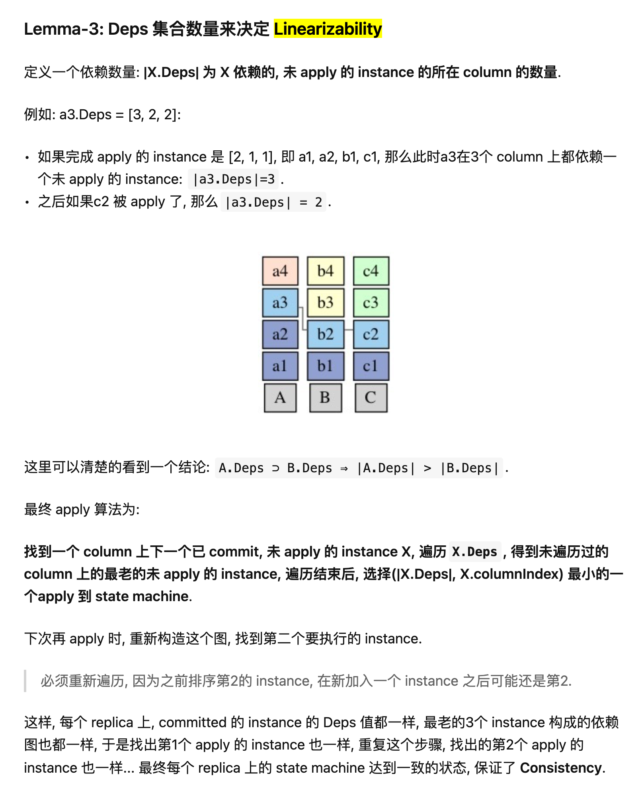

mmp3 协议中易被忽略的细节: 包含间接依赖才能保证线性一致性

[mmp3](https://blog.openacid.com/algo/mmp3/) 跟 epaxos 有个不同的地方, instance 复制到 replica 时要记录所有依赖的instance, 包括间接依赖的. 这是mmp3 保证 线性一致性的一个条件, 读过epaxos的同学可能会漏掉这个细节导致无法证明线性一致性. 例如下面这个容易出现疑问的 case:

```
Legend:

Ri:        replica
A, B, C:   instance
A->{B}:    instance A depends on instance B
A->{B, C}: instance A depends on instance B and C

timeline:

R1                  A   B->{A}  A->{C}
                    |   ^ |     ^
   .----------------|---' '-----|----.
   |                |      .----'    v
R2 B  C->{B}        |      |         B->{A}
      ^ '----.      '---.  |
   .--'      v          v  |
R3 C         C->{B}     A->{C}
---+--+------+------+---+-------+----+------> time
   t1 t2     t3     t4  t5      t6   t7
```

- t1: R2 propose B, 写到本地, R3 propose C, 写到本地.
- t2: R3 复制 C 到 R2, 写到 R2 磁盘的 C 包含对 B 的依赖: `C->{B}`.
- t3: R3 收到 response, 提交 `C->{B}`.
- t4: R1 propose A.
- **t5**: R1 复制 A 到 R3, R3记录 `A->{C}`(这步是有问题的, **重点**), 同时 R2 复制 B 到 R1, R1 记录 `B->{A}`.
- t6: R1 收到 response, 提交 `A->{C}`.
- t7: R2 收到 response, 提交 `B->{A}`.

这里有个容易漏掉的细节是, t5 时, 在 R3 上记录的 A, 应记录 `A->{B,C}`, 而不仅是`A->{B}`.

也就是说, **间接依赖的 instance 都应被记录到一个 instance 的依赖集(`Deps`) 里**. 这是 mmp3 跟 epaxos 不一样的地方, 这个改进保证了 mmp3 算法的正确性. (也是这个原因, epaxos 里因为没有记录间接依赖, 在修复过程中会导致也不一致).

如果没有这个细节, 最终形成的依赖关系是:

```
B <---.
|     |
|     |
v     |
A --> C
```

通过比较每个 instance 的依赖集的大小和column index,最终执行顺序是ABC, 违反了Linearizability的原则: A 在 C 提交之后被propose, 应该在C之后被apply.

加入这个间接依赖的约束后, t5时间A的依赖应为`{B,C}`,最终形成的依赖图如下:


```
B  <---.
|^     |
||     |
v|     |
A ---> C
```

- `A->{B,C}`
- `B->{A}`
- `C->{A}`

此时B被先 apply, 剩下`A->C`, 再apply C,然后是A, 保证了 Linearizability 的约束.



- mmp3 介绍: https://blog.openacid.com/algo/mmp3/
- mmp3 源码: https://github.com/openacid/mmp3

欢迎在原文评论区讨论:DD https://blog.openacid.com/algo/mmp3/
